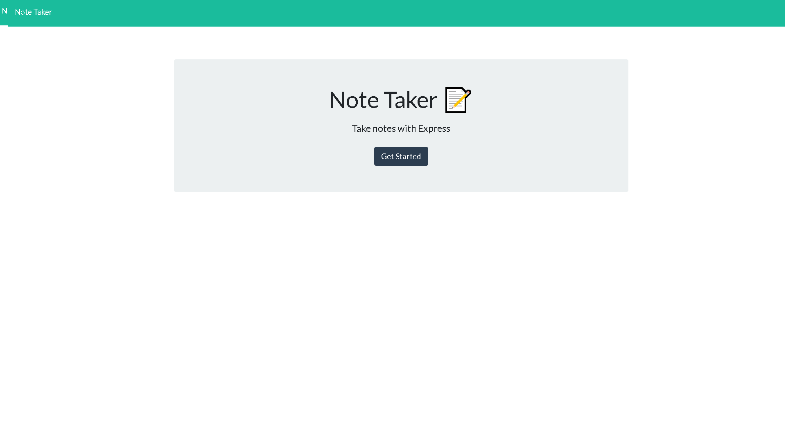

# Note Taker

## Express.js

## Description

Create an application called Note Taker that can be used to write and save notes using Express.js back end to save and retrieve note data from a JSON file. Connect to the front-end after building the back-end and deploy the application to

## Table of Content

- [Installation](#Installation)
- [Usage](#Usage)
- [Technology](#Technology)
- [Status](#Status)
- [Links](#Links)
- [Screenshots](#Screenshots)
- [Demo](#Demo)


## Installation

Clone Repository and install dependency packages by running the following command line:
```
npm i
```

## Usage

```
AS the USER
I WANT to be able to write and save notes
SO THAT I can organize my thoughts and keep track of tasks I need to complete
```

## Technology
#### Heroku
#### Javascript
- OOP
- FS (File System)
- Express
- Node.js


## Status

```
GIVEN a note-taking application:
```
- WHEN I open the Note Taker THEN I am presented with a landing page with a link to a notes page
- WHEN I click on the link to the notes page THEN I am presented with a page with existing notes listed in the left-hand \*column, plus empty fields to enter a new note title and the note’s text in the right-hand column
- WHEN I enter a new note title and the note’s text THEN a Save icon appears in the navigation at the top of the page
- WHEN I click on the Save icon THEN the new note I have entered is saved and appears in the left-hand column with the other existing notes
- WHEN I click on an existing note in the list in the left-hand column THEN that note appears in the right-hand column
- WHEN I click on the Write icon in the navigation at the top of the page THEN I am presented with empty fields to enter a new note title and the note’s text in the right-hand column
- *BONUS* When I click on the DELETE button THEN the selected note is deleted from the list.

```
All Acceptance criteria have been mets
```
```
Deployed Links: Github & Heroku
```
## Links

- Github: https://github.com/louyoon89/Note-Taker
- Heroku: https://pacific-taiga-48369.herokuapp.com/


## Screenshots
* Landing Page

* Note Taker Default Page

* Note Taker Sample (Initial Test Delete, New Notes Added)

* Command Line Console Logs:
<br>

## Demo

https://user-images.githubusercontent.com/113860554/207727565-3e58a49a-f2e9-4dd6-8737-0f13720013f3.mp4

